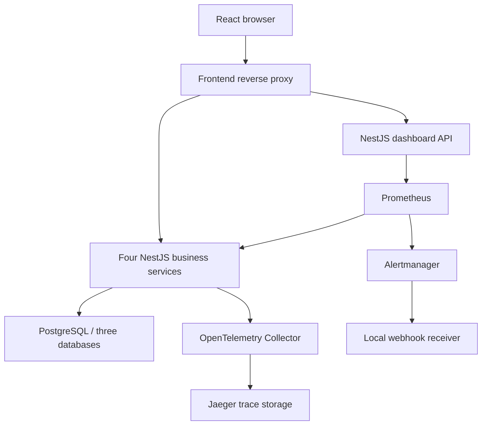

# Velora — Observability & DevSecOps Platform

A containerized hotel-booking application used as an observability lab: four NestJS business microservices export Prometheus metrics and OpenTelemetry traces, a fifth NestJS service queries monitoring data, and a React dashboard presents service health, CPU, memory, event-loop lag and active alerts.

The platform runs locally with **one Docker Compose command**, or in a disposable **Kubernetes/kind lab**. CI builds and tests all six applications, audits runtime dependencies, scans application images, validates monitoring rules, and exercises service failure and recovery.

## Quick start

Requirements: Docker Desktop with Linux containers, Docker Compose v2, Python 3.11+ and roughly 4 GB of available memory. Git Bash works on Windows.

```sh
python scripts/setup_env.py
docker compose up --build -d --wait --wait-timeout 240
```

Open **[the observability dashboard](http://localhost:8080/observability)**. No login is required for this local monitoring demo. The booking application is at `/`.

| Interface | Local URL |
| --- | --- |
| React dashboard | http://localhost:8080/observability |
| Prometheus targets and queries | http://localhost:9090 |
| Jaeger trace search | http://localhost:16686 |
| Alertmanager | http://localhost:9093 |
| Received webhook deliveries | http://localhost:9095/events |

Published ports bind to `127.0.0.1`. The database and business services have no host-published ports; the frontend reverse proxy routes browser API requests using service DNS names. To change the frontend port, edit `FRONTEND_PORT` in `.env`.

The setup script generates fresh database, JWT and internal API credentials. `.env` is ignored by Git. Credentials stay local and are not printed. For the original booking UI, registration/login work; email verification and password-reset flows require an email integration and are disabled. An optional admin seed account is described in [SETUP.md](docs/SETUP.md).

## Architecture



| Service | Responsibility |
| --- | --- |
| `auth-service` | JWT login and registration orchestration |
| `user-service` | User storage, password hashing and profile access |
| `admin-service` | Hotels, rooms and booking summary |
| `customer-service` | Reservations and availability |
| `dashboard-service` | Bounded-time queries to Prometheus and alert API |

OpenTelemetry initializes before NestJS/HTTP modules load. Each service has a distinct `service.name`; OTLP/HTTP goes to the collector, which batches and forwards traces over OTLP/gRPC to Jaeger. The first four services expose default Node.js/process metrics through `prom-client`. Process CPU is measured in CPU cores, not host utilization; RSS is shown in MiB and event-loop lag uses the 99th percentile in milliseconds.

## Alerts and controlled failure

The canonical rules live in [`monitoring/alerts.yml`](monitoring/alerts.yml):

| Alert | Condition | Pending duration |
| --- | --- | --- |
| `ServiceDown` | A business service scrape fails | 30 seconds |
| `HighCPU` | Process CPU exceeds 0.8 cores | 1 minute |
| `HighMemory` | Process RSS exceeds 256 MiB | 1 minute |
| `HighEventLoopLag` | p99 event-loop lag exceeds 100 ms | 30 seconds |

Prometheus scrapes and evaluates every five seconds. Alertmanager groups notifications and sends firing **and resolved** webhooks to the local receiver. This demonstrates notification delivery, not email/SMS/pager delivery. Promtool tests cover the rule thresholds and a healthy baseline.

```sh
docker compose stop auth-service
python scripts/smoke.py --alert firing --output verification/firing.json
docker compose start auth-service
python scripts/smoke.py --alert resolved --output verification/resolved.json
```

The receiver keeps the last 100 deliveries in memory. Expect additional evaluation/grouping delay beyond the rule's pending duration. [DEMO.md](docs/DEMO.md) walks through traces and alert recovery.

## DevSecOps verification

The [GitHub Actions workflow](../../actions/workflows/devsecops-pipeline.yml) performs:

1. `npm ci`, TypeScript/production builds and NestJS tests for all five backend services; React production build.
2. Blocking `npm audit --omit=dev --audit-level=high` checks for each application.
3. Promtool configuration/rule checks and rule unit tests; Alertmanager configuration validation; generated Kubernetes configuration drift check.
4. Six multi-stage application image builds and blocking Trivy scans for fixable HIGH/CRITICAL image vulnerabilities.
5. Compose HTTP, registration/login, four scrape targets, traces in Jaeger, service-failure webhook and recovery tests; desktop/mobile React screenshots and failed-fetch handling.
6. A kind cluster rollout with the same images, HTTP/telemetry checks, service scaling to zero, firing webhook and recovery. The cluster is deleted afterwards.

Each integration run uploads `velora-verification-RUN_ID`: receipts, screenshots, scan reports and diagnostics. Check a completed run rather than assuming a configured test has passed. [VERIFICATION.md](docs/VERIFICATION.md) records evidence and limits.

Applications run as non-root users with dropped capabilities and read-only root filesystems. Kubernetes workloads include probes, resource requests/limits and disabled service-account token mounting. This does not make the booking application production-ready; see [SECURITY.md](SECURITY.md).

## Kubernetes lab

[`k8s/lab.yaml`](k8s/lab.yaml) contains Deployments, ClusterIP Services and configuration. It is generated from canonical Compose/monitoring sources by `python scripts/render_kubernetes.py`; CI checks for drift.

Follow [KUBERNETES.md](docs/KUBERNETES.md) for local image loading, Secret creation and port forwarding. Kubernetes PostgreSQL/monitoring storage uses **emptyDir**, so this deployment is deliberately disposable. Compose database and Prometheus data use named volumes.

## Cleanup

```sh
docker compose down
# Delete persistent local lab data only when intended:
docker compose down -v
# Remove a kind lab created for this project:
kind delete cluster --name velora
```

## Repository guide

| Path | Contents |
| --- | --- |
| `compose.yaml` | Complete local application and observability stack |
| `backend/velora-platform/` | Five NestJS service implementations |
| `frontend/` | React UI, reverse proxy and browser verification |
| `monitoring/` | Collector, Prometheus, Alertmanager and rule tests |
| `k8s/` | Generated disposable Kubernetes deployment |
| `scripts/` | Setup, live verification, failure simulations and manifest generation |
| `docs/` | Setup, Kubernetes, demo, verification and interview notes |

Built from the original INSAT academic Velora/PFA application. Existing application sources and team assets are retained; explain your own contribution accurately when presenting it. This refinement was developed with AI assistance. No new blanket license is assigned to the existing team's code.
